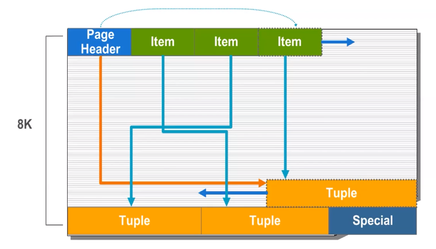

# Process Architecture

- Postgresql uses processes, not threads!
- The postmaster process acts as a supervisor for all other processes
- One backend process per user session
  - postmaster listens for new connections

## Process and Memory Architecture

- Postmaster (responsible for the bellow processes)
  - Shared Memory:
    - Shared Buffers
    - WAL Buffers
      - WAL Segments
    - Process Array
  - Background Writer:
    - Flush data blocks to disk after 5min or Shared Buffers are full
  - Checkpointer (every 5 minutes):
    - Automatically perform checkpoints
  - Autovacuum:
    - Automatic maintenance
  - WAL Writer (sync to disk):
    - Flushes write-ahead log to disk
  - Logger:
  - Stats Collector:
    - Record stats inside database dictionaries
  - Archiver:
    - Record WAL Segments -> Archived WAL area
  - Logical Replication:
    - Take WAL Segments -> Replicate to other databases

## Memory Architecture

- Shared Buffers
  Read and Write to Data Files on disk
- WAL Buffers

The data change from Transactions are on the Shared Buffers, and then those changes are logged in the WAL Buffers and when commit happens the changes are written to disk.

- Process Array informations about the processes that are running.

### Disk Read Buffering

- Steps:
  - Each user session is a process in postgresql;
  - Postmaster assign a process to a user session;
  - SQL query is sent to the user process;
  - (Logical I/O) The first step the process is doing after SQL Query is received is to check if the data is already in the Shared Buffers;
  - (Phisycal I/O) If the data is not in the Shared Buffers, the process will read the data from the disk and put it in the Shared Buffers;

### Disk Write Buffering

- Steps:
  - Data is record on the Shared Buffers;
  - After the user commit, the data on Shared Buffers are marked as committed ("final commit");
  - After some time (5 min) the BGWRITER must sync data back to the disk (checkpoint);
    - If a crash happens, the data can be recovered.
    - Checkpoint could be controlled by time (default is 5 min);
    - Checkpoint could be controlled by WAL size;

### Background Writer

BGWRITER is a background process that writes data blocks to disk from time to time to clean up the Shared Buffers.

### Write Ahead Logging (WAL)

Write to disk kind of as a history, so we can go back in time and replay the changes.
Durability is guaranteed by WAL.
Each and every change is recorded in the Log.
Record the query into the Shared Buffers and also the WAL Buffers.
When a commit happens, even before the "final commit" WAL Buffers are flush to disk and a "Ok" signal should be return to effective commit the transaction.
WAL Writer is responsible for flush the WAL Buffers to the Transaction Log.
If the Archiver is enable, the Transaction Log that are full should be copied to the Archive Log (Point-In-Time Recovery).

### Commit and Checkpoint

- Before commit:
  Uncommitted updates are in Memory (Shared Buffers);
- After commit:
  WAL buffers are flushed to disk (WAL log) and Shared Buffer are marked as committed ("final commit");
- After checkpoint:
  Modified data pages are written from Shared Memory to the data files;

## Connection Request-Response Cycle

Postmaster will receive the request and will assign a process to the request.
Postmaster is the listener, and listen on 1 port (default 5432).
Postmaster will spawn a new user backend process to handle the request, with its own work_mem.
This new process do every thing related to Authentication and Authorization.

## Statement Processing

- SQL Engine (part of the user process):
  - Parse
    - Check syntax
    - Call Traffic Cop
    - Identify Query Type
    - Command Processor if needed
    - Break Query in Tokens
  - Optimize
    - Planner generate Plan
    - Uses Database Statistics
    - Query Cost Calculation
    - Choose Best Plan
  - Execute
    - Execute Query

Traffic Cop is responsible for checking the type of Query to see if it needs optimization or not (for example, DDL does not need optimization).

## Storage Architecture

- Cluster is a collection of database managed by one server instance (users, tablespaces and databases).
- Each cluster has a data directory, TCP port and set of processes.
  - Data directory is the place where the data is stored.
- A Cluster can contain multiple databases.

### Installation Directories

Installation directory: /usr/pgsql-<version>

- bin - Programs
- lib - Libraries
- share - Shared data

Default Data directory: /var/lib/pgsql/<version>/data

### Database Cluster Data Directory Layout

Main directories:

- postgresql.conf: Configuration file
- pg_hba.conf: Authentication file
- postgresql.auto.conf: Auto configuration file
- global: Cluster wide database objects
- base: Contains Database (if you have 5 databases, you should see 5 folders)
- pg_tblsc: Symbolic links to tablespace
- pg_wal: Write Ahead Logs
- log: Startup and Error logs
- Others

### Physical Database Architecture

Each table has its own data file, same for indexes.
Data file for each table is chunked by 1GB (data segments).
A tablespace is a directory.

### Page Layout

Minimum Page size is 8 Kb, when it reaches 1GB is chunked.

- Header
- Rows/index pointers
- Free space
- Row/index entry (data)
- Special

